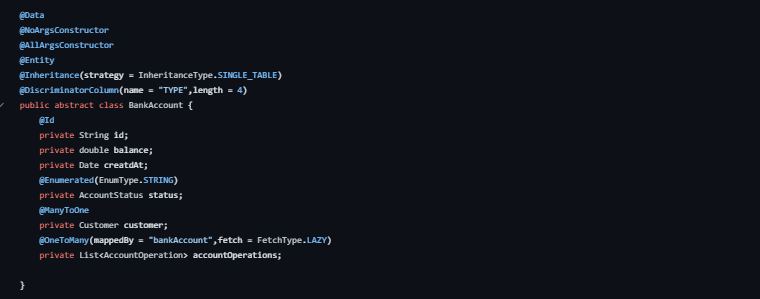

# Digital-Banking
Notre projet consiste sur la création d'une application qui permet
de gérer des comptes bancaires. chaque compte appartient à un client.
un compte peut subir plusieurs opérations de type DEBIT ou CREDIT.
Il existe deux types de comptes : Comptes courants et comptes épargnes.
L'application se compose des couches suivantes :
- Couche DAO (Entités JPA et Repositories)
- Couche Service définissant les opérations suivantes :
    - Ajouter des comptes
    - Ajouter des client
    - Effectuer un débit (Retrait)
    - Effectuer un crédit (Versement)
    - Effectuer un virement
    - Consulter un compte
- La couche DTO
- Mappers (DTO <=>Entities)
- La couche Web/services (Rest Controllers)

## Cas d'utilisation Digital banking

## BackendEnd
Structure du projet:

### Entities

### Repositories

### Services

### DTOs

### Enums

### RestControllers

okok

## FrontEnd

